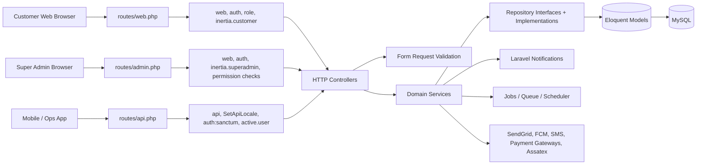
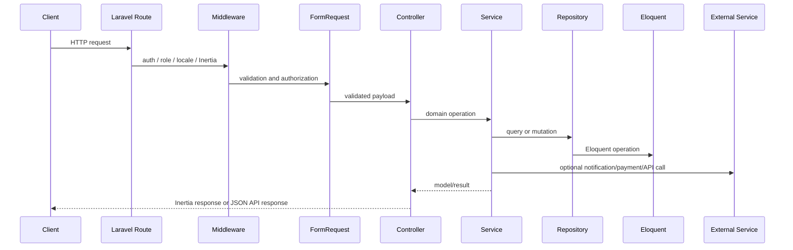
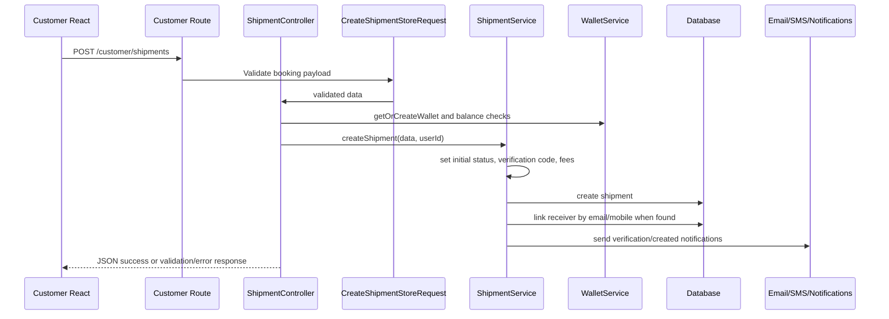
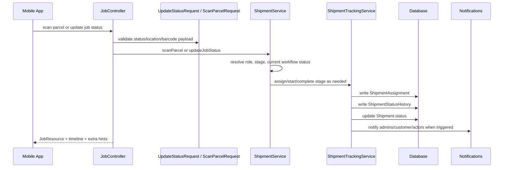
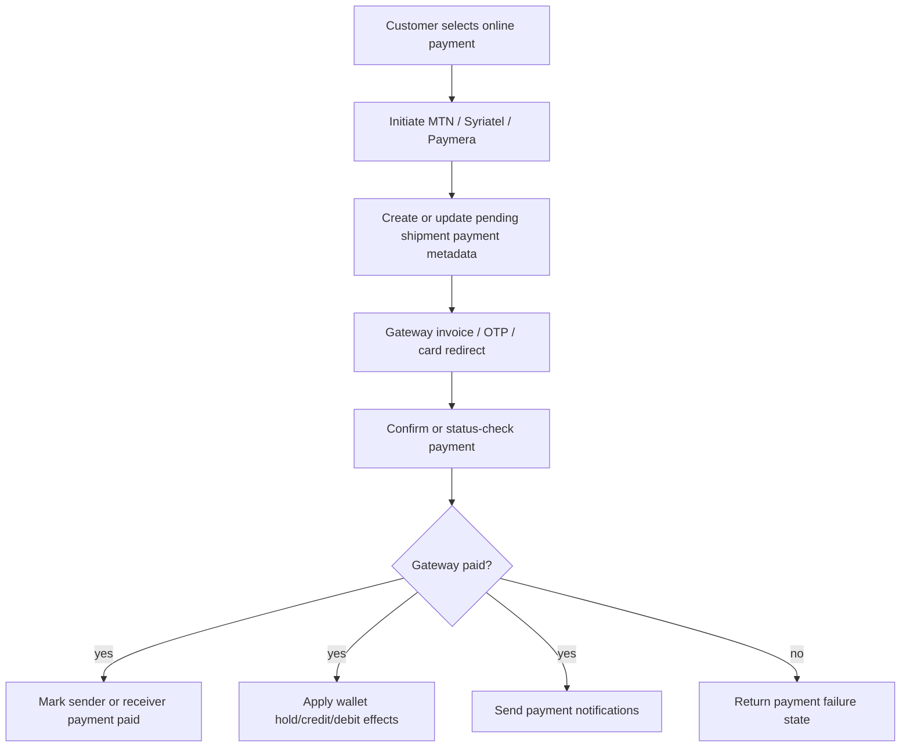

# BoxyGO Backend Blueprint (Laravel)

## Scope

- Laravel 12 backend inside a monorepo root.
- React/Inertia assets live under `resources`, but Laravel owns routing, auth, validation, persistence, and server-rendered props.
- Backend serves three runtime surfaces:
- Customer web portal through `routes/web.php`.
- Super-admin portal through `routes/admin.php`.
- Mobile/operations JSON API through `routes/api.php` under `/api/v1`.
- Core domain is logistics: bookings, shipments, riders, drop points, warehouses, shelves, wallets, COD, payment gateways, tracking, and notifications.
- Source of truth is Eloquent models and MySQL-backed migrations.
- Business logic is split across controllers, services, repositories, request validators, resources, helpers, notifications, and console commands.

## Architecture Diagram



## Runtime Surfaces

### Customer Web

- Route file: `routes/web.php`.
- Root auth group: `guest`, `inertia.customer`.
- Protected group: `auth`, `role:customer`, `inertia.customer`.
- Main screens: login, register, verify, forgot/reset password, dashboard, create booking, sending parcels, receiving parcels, addresses, wallet, settings, FAQ, terms.
- Public tracking: `GET /track/{trackingNumber}` renders the receiving-parcels detail view with public mode enabled.
- Shipment actions: create, cancel, return request, compensation request/status, review, pay-now, rateable actors.
- Payment routes: MTN, Syriatel, Paymera initiate/confirm/status/resend/return/callback endpoints.
- Upload routes: photo and document uploads under `/customer/uploads/*`.
- Paymera callback bypasses CSRF through `bootstrap/app.php`.

### Super Admin Web

- Route file: `routes/admin.php`, mounted with `web` middleware from `bootstrap/app.php`.
- Prefix/name convention: `/admin`, `admin.*`.
- Guest group: `guest`, `inertia.superadmin`.
- Authenticated group: `auth`, `inertia.superadmin`.
- Module routes: dashboard, notifications, settings, roles, employees, customers, warehouses, drop points, zones, parcels, shipment assignment/tracking, vehicles, wallets, COD, pricing, heatmap, live tracking, ratings.
- Sensitive actions use controller permission checks such as `admin.access`, `shipments.assign`, `shipments.manage`, `shipments.tracking`, and module-specific `*.view` / `*.manage`.
- Admin landing route resolves the first accessible route through `AdminRouteResolver`.

### Mobile / Operations API

- Route file: `routes/api.php`.
- Prefix: `/api/v1`.
- Public modules: auth, OTP, password reset, terms, policy, help support, cities, city check, zone check, Google location proxy.
- Protected group: `auth:sanctum`, `active.user`.
- Protected modules: logout, change password, vehicles, jobs, barcode, scan parcel, COD collection, shipment price calculation, shelves, profile, documents, profile picture, nearest drop-point keeper, earnings, cash deposit, notifications, mileage, ratings.
- Shelf API has an additional role middleware limited to drop point keepers and warehouse keepers.

## Request Lifecycle



## Folder Structure

```text
app/
  Channels/                 FCM and extended database notification channels
  Console/Commands/          shipment expiry, unpaid cancellation, FCM cleanup, sync/backfill utilities
  Contracts/                 service and repository interfaces
  Enums/                     Role, ShipmentStatus, DeliveryStage, Parcels
  Helpers/                   global helpers and date helpers
  Http/
    ApiResponse.php          central JSON response helper
    Controllers/             Api/V1, Customer, SuperAdmin, Auth controllers
    Middleware/              auth, active-user, API locale, customer/admin Inertia middleware
    Requests/                Api, Auth, Customer, Vehicle form requests
    Resources/               JobResource, UserResource, VehicleResource, NotificationResource
  Jobs/                      queued jobs, including external zone sync
  Mail/                      invitation, verification, welcome, shipment verification mailables
  Models/                    User, Shipment, Wallet, Zone, Shelf, Vehicle, payment/status models
  Notifications/             shipment, delivery, payment, return, compensation, generic notifications
  Providers/                 RepositoryServiceProvider bindings
  Repositories/              abstract and domain repositories
  Rules/                     validation rules such as RejectSuspiciousText
  Services/                  shipment, tracking, wallet, pricing, payment, SMS, FCM, external APIs
  Support/                   FinancialSettings, ShipmentPaymentHelper, AdminRouteResolver
database/                    migrations and seeders
routes/                      api.php, web.php, admin.php, console.php
resources/                   Inertia root views and React assets
```

## Service and Repository Layer

- `RepositoryServiceProvider` binds interfaces to concrete implementations.
- Bound repositories include user, role, employee, zone, parcel, vehicle, address, shipment, shelf, and rating repositories.
- Bound services include user, role, employee, zone, parcel, vehicle, address, shipment, shelf, rating, and customer auth services.
- Controllers depend on service interfaces where available.
- Services own cross-model business operations.
- Repositories own pagination, filtering, lookup, and persistence helpers.
- `AbstractRepository` and `AbstractService` provide shared behavior for resource-style modules.
- Direct Eloquent access still exists in controllers and services for complex dashboard, payment, and workflow queries.

## Core Domain Modules

### Authentication and OTP

- Mobile API login is handled by `App\Http\Controllers\Api\V1\Auth\LoginController`.
- Customer web login is handled by `App\Http\Controllers\Customer\LoginController`.
- Admin login is handled by `App\Http\Controllers\SuperAdmin\LoginController`.
- OTP verification and resend flows use `OtpVerificationController` and `OtpService`.
- Password reset uses OTP-style verification endpoints.
- API login accepts email or phone number.
- API login validates that the user has a Mobile App platform role.
- API login stores FCM token and device type when present.
- API logout clears FCM token/device type and deletes the current Sanctum token.
- Customer logout clears FCM token/device type, invalidates the session, and regenerates CSRF token.

### User, Role, and Permission Model

- `User` uses `HasApiTokens`, `Notifiable`, and Spatie `HasRoles`.
- Roles are defined in `App\Enums\Role`.
- Platform mapping:
- `superadmin` maps to Admin Portal.
- `customer` and `receiver` map to Customer Portal.
- `rider`, `drop point keeper`, `car driver`, and `warehouse keeper` map to Mobile App.
- Permissions are seeded in `RolesAndPermissionsSeeder`.
- Admin permissions use `resource.action` naming.
- Mobile permissions exist for jobs, shelves, vehicles, profile, notifications, and COD.
- Superadmin receives all seeded permissions.
- Customer and mobile operational roles receive no permissions by default.
- Zone assignment is modeled through `zone_id` and `zone_ids`.
- `User::getAssignedZoneIds()` merges primary and additional zone IDs.
- `User::hasZone()` checks if an employee is assigned to a zone.

### Shipment and Job Workflow

- `Shipment` is the core aggregate.
- Shipment owns sender, receiver, parcel, delivery mode, fees, payment fields, status, zone, rider, delivery rider, shelf, return data, compensation data, and proof images.
- Shipment auto-generates `order_number` in the model `creating` event.
- Status enums live in `App\Enums\ShipmentStatus`.
- Direct delivery statuses are ordered by `ShipmentStatus::directStatuses()`.
- Indirect delivery statuses are ordered by `ShipmentStatus::indirectStatuses()`.
- Delivery stages live in `App\Enums\DeliveryStage`.
- `ShipmentAssignment` records assigned operational user, role, stage, assigned-by user, start time, and completion time.
- `ShipmentStatusHistory` records from/to status, progress index, actor, optional coordinates, location name, notes, metadata.
- `Shipment::getCompleteTimeline()` merges assignments and status history into one chronological audit trail.
- `Shipment::scopeForUser()` filters admin shipments by zone and mobile shipments by assigned rider.
- `Shipment::requiresReceiverPaymentConfirmation()` identifies receiver-side online payment requirements.

### Operational Geography

- `Zone` stores external IDs, code, name, city, sub-district, delivery flags, service fees, drawn paths, status, deletion flag, hub assignment, and bounding box.
- `Zone::notDeleted()` filters custom soft-deleted zones.
- `DropPoint` stores external IDs, serial/DP numbers, opening hours, zone mapping, address, city, and coordinates.
- `Warehouse` stores code, name, location, city, coordinates, zone, status, and drawn paths.
- `Shelf` stores code, location, capacity, occupied slots, active flag, drop point, and warehouse.
- `ZoneHelper` and `ZoneService` support coordinate-to-zone resolution and assigned employee lookup.
- Assatex integration syncs zones, drop points, and city shipment prices.

### Pricing and Financial Settings

- `PriceCalculator` calculates city-to-city pricing using governorate and city type rules.
- `ShipmentPriceController` exposes price calculation to web/API clients.
- `FinancialSettings` reads and persists system settings under `financial_settings.*`.
- Financial defaults include VAT, platform fee, door/direct/indirect service fees, insurance type/value, and insurance bounds.
- `ShipmentPaymentHelper` calculates shipment payment details for display and collection.
- Shipment creation stores insurance, platform fee, and VAT at creation time where applicable.
- Pricing data includes `City`, `Governate`, and `CityShipmentPrice`.

### Wallets, COD, and Payment Transactions

- `WalletService` creates wallets, paginates wallets, credits, debits, holds, releases, deducts held balances, and reads transactions.
- Wallet balances are stored in `wallets.balance` and `wallets.held_balance`.
- Wallet transaction types include credit/debit with statuses such as completed, held, released, and pending.
- COD collections are stored in `payment_transactions`.
- Payment transaction types include rider, car driver, drop point keeper collection, and admin settlement.
- `CodManagementController` exposes admin COD collection management.
- `JobController::collectPayment()` handles mobile COD collection.
- `ShipmentService::checkCodLimitForAssignment()` blocks assignment that exceeds an employee COD collection limit.

### Online Payments

- `OnlinePaymentController` coordinates MTN, Paymera, and Syriatel flows.
- Payment flow supports new shipment payment, existing shipment payment, and return shipment payment.
- Sender and receiver payer contexts are tracked separately.
- Receiver fields use existing `reciever_*` column names from the schema.
- Payment initiation stores gateway, invoice, GUID/operation data, and gateway response metadata.
- Payment confirmation updates payer-specific status, shipment payment state, wallet effects, and notifications.
- `MtnPaymentService`, `SyriatelPaymentService`, and `PaymeraPaymentService` isolate gateway calls.
- Paymera callback is registered as `Route::match(['get', 'post'], '/customer/payments/paymera/callback', ...)`.
- Payment status endpoint refreshes state from the gateway and persists status-check metadata.

### Notifications and Messaging

- Laravel notifications provide database and FCM delivery.
- `FcmChannel` and `FcmService` send Firebase Cloud Messaging v1 messages.
- Web/PWA notifications are data-only because the Firebase service worker renders notifications.
- Invalid or expired FCM tokens are cleared from users.
- `ExtendedDatabaseChannel` customizes database notification storage.
- Shipment events use specific notification classes for created, assigned, picked up, delivered, incomplete, return, compensation, and payment states.
- `MtnSmsService` sends localized SMS for assignment, payment, and shipment events.
- `SendGridEmailService` sends verification, password reset, invitation, welcome, and shipment verification emails.

### Admin Dashboard and Operations

- `SuperAdmin\DashboardController` loads shipments, riders, stats, heatmap data, payment data, status history, assignments, reviews, and computed UI flags.
- Admin dashboard filters shipments by search, date, sort, payment readiness, and current admin zone scope.
- Assignment endpoints:
- `assignRider`.
- `unassignRider`.
- `assignDeliveryRider`.
- `unassignDeliveryRider`.
- `updateAdminNotes`.
- Pickup rider assignment is blocked for drop-point-starting indirect modes.
- Delivery rider assignment applies to door-to-door and drop-point-to-door modes after the shipment reaches the DP2 chain.
- Status transitions are recorded through `ShipmentTrackingService`.

## Data Model Detail

- `users`: identity, role membership, platform, status, profile, documents, zone assignment, location, notification preferences, FCM token.
- `shipments`: booking data, pickup/dropoff data, fee breakdowns, payment fields, rider references, status fields, returns, compensation, proof media.
- `shipment_assignments`: stage-level actor assignment, assigned-by user, assigned/start/completion timestamps.
- `shipment_status_history`: append-only status audit trail with optional GPS and metadata.
- `wallets`: user balance and held balance.
- `wallet_transactions`: wallet ledger entries for credit, debit, hold, release, refund, and pending states.
- `payment_transactions`: COD collection and admin settlement events linked to shipments.
- `zones`: operational areas, external sync fields, service flags, drawn paths, bounding boxes.
- `drop_points`: pickup/dropoff operational points with zone mapping and coordinates.
- `warehouses`: warehouse locations with zone linkage, status, coordinates, drawn paths.
- `shelves`: storage capacity, occupancy, warehouse/drop-point linkage, shipment placement.
- `vehicles`: operational vehicle registration, documents, status, assigned user.
- `parcels`: parcel size/type catalog and external API mapping key.
- `shipment_reviews`: ratings for riders, car drivers, and drop point keepers.
- Primary relationships: user has wallet/vehicles/shipments; shipment belongs to user/rider/delivery rider/barcode rider/shelf/zone/parcel; shipment has assignments/status history/payment transactions/review; zone has employees/shipments/warehouses; drop point and warehouse have shelves and assigned users.

## API Layer

### JSON Response Convention

- `App\Http\ApiResponse::success()` returns `{ success: true, message?, data? }`.
- `created()` wraps HTTP 201.
- `noContent()` returns HTTP 204 with success flag.
- `validationError()` returns HTTP 422 with errors.
- `badRequest()`, `unauthorized()`, `forbidden()`, `notFound()`, and `serverError()` return consistent error JSON.

### API v1 Public Endpoints

- Auth: register, verify/resend OTP, login, forgot password, verify/resend reset code, reset password.
- Info: terms, policy, help support.
- Location/catalog: cities, city check, zone coordinate check, Google location search proxy.
- Utility/test: `update-wallet` and debug Damascus price endpoint exist outside the protected operational API.

### API v1 Protected Endpoints

- Session/token: logout, change password, current user.
- Jobs: list, detail, valid statuses, update status, barcode update, scan parcel, cancel shipment, timeline, active users, collect payment.
- Operations: vehicle index/store, shelves index/assign for keeper roles, profile update, documents, profile picture, nearest drop-point keeper, earnings, cash deposit.
- Notifications: list, mark read, mark all read.
- Metrics: mileage stats/logs/daily summary/shipment mileage.
- Catalog: ratings and shipment price calculation.

## Key Flow: Customer Shipment Creation



### Shipment Creation Responsibilities

- Validate customer payload with `CreateShipmentStoreRequest`.
- Normalize amounts using floor operations in controller.
- Set `booking_type` to `shipment`.
- Check wallet balance for non-cash sender-paid amounts.
- Persist sender payment status when sender amount is zero or online funds exist.
- Normalize `indirect_delivery_mode` to null for direct delivery.
- Detect zones from coordinates in online payment creation path.
- Detect different-city flag from `from_city_id` and `to_city_id`.
- Create direct or indirect status index record after shipment creation.
- Generate six-digit verification code.
- Store insurance fee at creation time.
- Resolve platform fee and VAT through `FinancialSettings`.
- Send receiver verification email when receiver email exists.
- Notify receiver/sender/admin based on payment and shipment states.

### Shipment Creation Edge Cases

- Missing coordinates prevent reliable zone detection in some paths.
- Missing receiver account leaves receiver ID null while receiver contact data remains on shipment.
- Online payment creates pending shipment state before confirmation.
- Insufficient wallet balance returns HTTP 422-style JSON.
- Direct delivery ignores indirect mode values.
- Return delivery fee payer changes sender/receiver payable amounts.
- Insurance only applies when opted in and goods amount falls inside configured bounds.

## Key Flow: Operational Scan and Status Update



### Status Update Responsibilities

- Identify actor role from authenticated user.
- Load shipment available to the role.
- Validate zone match for operational users.
- Resolve current status from latest history or shipment field.
- Map current status to expected role, stage, and next status.
- Create assignment when scan implies actor acceptance.
- Complete active assignment when stage finishes.
- Record status history with coordinates and metadata.
- Update mileage logs when prior GPS point exists.
- Return nearest actor hints for specific indirect handoff statuses.
- Mark return shipment sender payment status pending when return delivery completes.

### Status Update Edge Cases

- Inactive API users are rejected before controller execution.
- Role mismatch returns forbidden or bad request responses.
- Shipment in another zone throws domain exception.
- Final statuses stop further workflow progress.
- Incomplete cancellation flow resolves from `incomplete_status`.
- Drop-point-starting delivery skips pickup statuses.
- Drop-point-ending delivery hides door-delivery statuses from customer/admin timelines.
- Door delivery after DP2 requires separate delivery rider assignment.

## Key Flow: Online Payment



### Payment Responsibilities

- Validate shipment/payment payload with controller-level validator rules.
- Create pending shipment for new online bookings.
- Store payer context as sender or receiver.
- Keep separate metadata columns for sender and receiver payment gateways.
- Generate invoice IDs with shipment ID, payer code, payment type, and timestamp.
- Persist gateway response under payment gateway response JSON columns.
- Confirm OTP for MTN and Syriatel flows.
- Redirect and handle Paymera card return/callback flow.
- Refresh status using payment status endpoint.
- Apply post-payment wallet processing before marking paid.
- Send completion or failure notifications.

## Permission and Auth Handling

- `bootstrap/app.php` aliases custom and Spatie middleware.
- `auth` alias points to custom `App\Http\Middleware\Authenticate`.
- `active.user` blocks inactive users and deletes API tokens.
- `role` and `permission` aliases point to Spatie middleware.
- `guest` alias points to custom role-based redirect middleware.
- Customer Inertia middleware shares compact user data, config, and flash.
- Super-admin Inertia middleware shares user data, roles, permissions, config, and flash.
- API locale middleware is prepended to the API stack.
- Admin controller methods check permission strings for sensitive actions.
- API job logic checks role capability in controller and service layers.

## Deployment and Environment Setup

- Runtime: PHP `^8.2`, Laravel `^12.0`, MySQL, Composer, Node/NPM, Vite.
- Build/install: `composer install`, `php artisan key:generate`, `php artisan migrate --force`, `npm install`, `npm run build`.
- Long-running processes: web server, queue worker, scheduler, storage link, database queue when `QUEUE_CONNECTION=database`.
- Scheduler entry: `shipments:auto-cancel-unpaid`.
- External config: SendGrid templates/API key, Firebase service account, Firebase web/VAPID values, MTN SMS/payment, Syriatel, Paymera, Google Maps/Places, Assatex URL/API key.

## Testing Strategy

- Runner: PHPUnit 11 through `php artisan test`.
- Test environment: SQLite in-memory DB, array cache/session/mail, sync queue.
- Existing feature tests: example behavior, admin vehicle management, API v1 auth login, customer registration.
- Existing unit tests: example behavior, FCM service payload, shipment payment helper.
- Coverage targets: cash shipment creation, pending online shipment creation, MTN/Syriatel confirmation idempotency, Paymera callback handling, COD assignment block, role-based scan transitions, zone-scoped admin access, wallet math, return-window validation, notification payload shape.
