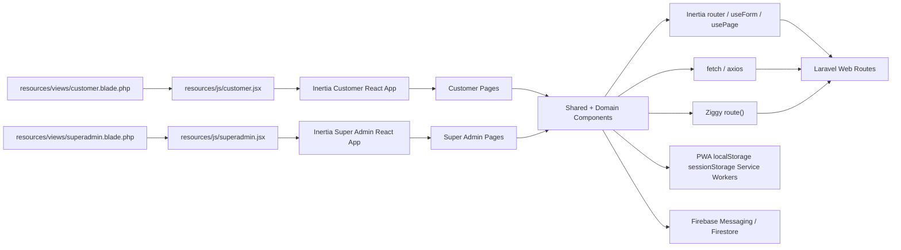
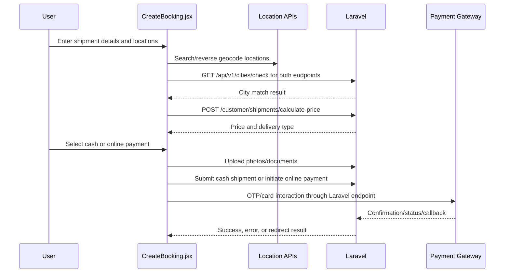
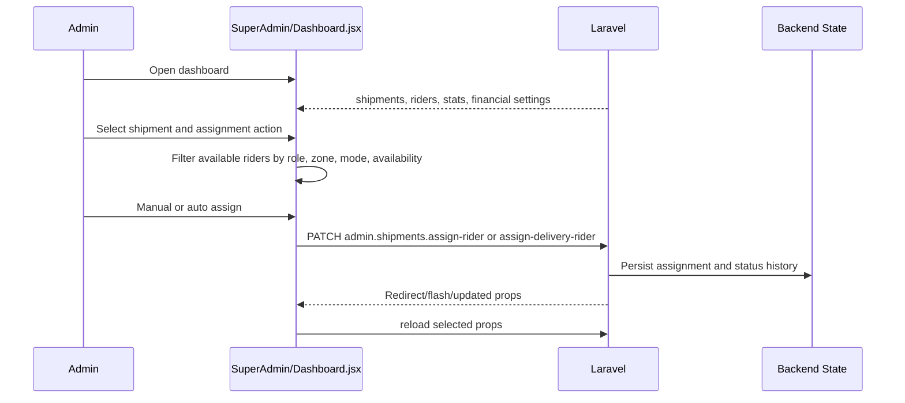
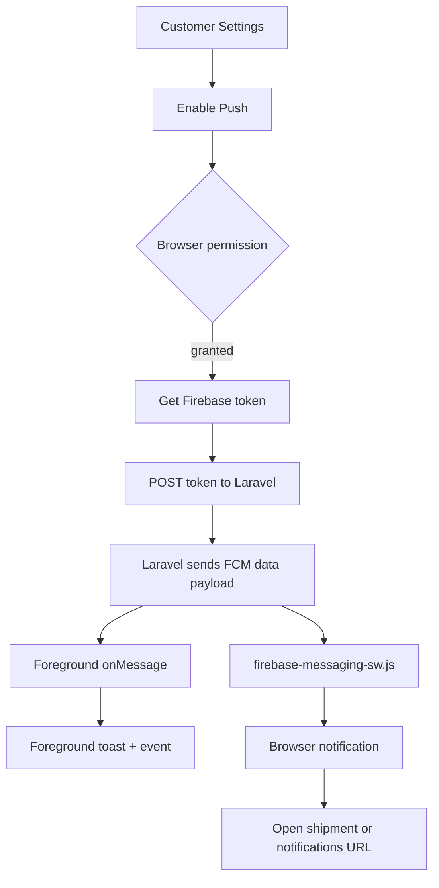

# BoxyGO Frontend Blueprint (React)

## Scope

- React 18 frontend lives under `resources/js`.
- Laravel serves React through Inertia root blade views.
- Customer and super-admin portals are separate Vite bundles.
- Customer bundle includes PWA and Firebase push support.
- Super-admin bundle includes operational dashboard, management modules, maps, exports, and live tracking.
- React consumes Laravel-provided Inertia props, named routes through Ziggy, and JSON endpoints through `fetch` or Axios.
- Frontend state is mostly local component state plus Inertia page props.

## Architecture Diagram



## Runtime Entry Points

### Customer Bundle

- Entry file: `resources/js/customer.jsx`; CSS input: `resources/css/customer.css`.
- Imports `bootstrap.js`, `i18n.js`, `LanguageProvider`, `ForegroundNotificationToast`, and push notification initialization.
- Resolves pages eagerly through `import.meta.glob('./Pages/**/*.jsx', { eager: true })`.
- Wraps the Inertia app in `LanguageProvider`.
- Registers `/sw.js` with scope `/customer/`.
- Initializes customer push notifications from `auth.user.push_notifications`.

### Super Admin Bundle

- Entry file: `resources/js/superadmin.jsx`; CSS input: `resources/css/superadmin.css`.
- Imports `bootstrap.js`, `i18n.js`, and `LanguageProvider`.
- Resolves pages eagerly through the same page glob.
- Wraps the Inertia app in `LanguageProvider`.
- Uses `auth.user.language` as the initial language value.

### Default / Legacy Bundle

- Entry file: `resources/js/app.jsx`; root view: `resources/views/app.blade.php`.
- Loads `bootstrap.js`, resolves all pages, and renders a basic Inertia app.

## Root Views

### Customer Root View

- File: `resources/views/customer.blade.php`.
- Adds CSRF meta token.
- Adds PWA metadata.
- Adds manifest link `/manifest.json?v=1.0`.
- Adds PWA icons and Apple touch icon.
- Includes `@routes` for Ziggy.
- Loads `resources/js/customer.jsx` and `resources/css/customer.css`.
- Renders `@inertia`.

### Super Admin Root View

- File: `resources/views/superadmin.blade.php`.
- Loads Archivo font.
- Includes `@routes`.
- Loads `resources/js/superadmin.jsx` and `resources/css/superadmin.css`.
- Uses `font-archivo` and admin background styling.
- Renders `@inertia`.

### Default Root View

- File: `resources/views/app.blade.php`.
- Loads Archivo font.
- Adds basic PWA links.
- Includes `@routes`.
- Loads `resources/js/app.jsx` and `resources/css/app.css`.
- Renders `@inertia`.

## Folder Structure

```text
resources/js/
  app.jsx, customer.jsx, superadmin.jsx          bundle entries
  bootstrap.js, i18n.js                          global HTTP and localization setup
  firebase.js                                    Firebase app/messaging/firestore helpers
  pushNotifications.js                           customer web push lifecycle
  foregroundNotifications.js                     browser custom notification events
  Contexts/LanguageContext.jsx                   language and direction state
  hooks/useLocaleFormatter.js                    localized number/date helpers
  Services/LocationService.js                    Google/OSM search and reverse geocoding
  utils/customerPaymentApi.js                    customer payment JSON wrappers
  utils/shipmentCalculationApi.js                city check and shipment price wrapper
  Pages/
    Customer/                                    customer auth, dashboard, booking, parcels, wallet, settings
    SuperAdmin/                                  admin dashboard, management modules, maps, tracking
    Layouts/                                     guest, authenticated, super-admin layout shells
    Auth/                                        default auth page
  Components/
    Common/                                      table, card, heatmap widget, inputs, sync progress
    Customer/                                    portal shell, maps, payments, notifications, media
    SuperAdmin/                                  map drawing/viewing and dialogs
    Shared/                                      QR code and cross-surface pieces
resources/css/                                   app.css, customer.css, superadmin.css
public/                                          manifest, service workers, PWA icons, static assets
```

## Shared Runtime Utilities

### Bootstrap

- `bootstrap.js` exposes Axios on `window.axios`.
- Axios sends `X-Requested-With: XMLHttpRequest`.
- Lodash is exposed as `window._`.
- jQuery is exposed as `window.$` and `window.jQuery`.
- jQuery AJAX setup reads CSRF token from `<meta name="csrf-token">`.

### i18n

- `i18n.js` uses `i18next`, `react-i18next`, and browser language detector.
- Translation resources load from `lang/en.json` and `lang/ar.json`.
- Fallback language is English.
- Initial language reads `localStorage.language` or defaults to English.
- Detection order is localStorage then navigator.
- Interpolation disables escaping because React escapes output.

### Language Context

- `LanguageContext.jsx` wraps portal apps.
- Exposes `currentLanguage`, `direction`, `changeLanguage`, and `isRTL`.
- Authenticated user language overrides localStorage on initial load.
- Guest pages default to English.
- Changing language updates i18next, localStorage, `document.documentElement.dir`, and `document.documentElement.lang`.

### Firebase

- `firebase.js` reads `VITE_FIREBASE_*` values from Vite env.
- `getFirebaseApp()` initializes Firebase only when required config exists.
- `getFirebaseFirestore()` returns Firestore or null.
- `getFirebaseMessagingInstance()` checks browser support before returning messaging.
- `getFirebaseMessagingToken()` requires `VITE_FIREBASE_VAPID_KEY`.
- `deleteFirebaseMessagingToken()` deletes local messaging token.
- `onFirebaseForegroundMessage()` registers foreground message callback.

## State Management

- Inertia page props hold server state.
- `usePage()` reads auth, permissions, flash, filters, shipments, riders, config, and financial settings.
- `useForm()` handles form state for many admin/customer forms.
- `router` handles navigation, reloads, and mutations.
- Local `useState` handles modal, drawer, filter, pagination, loading, and transient form state.
- `useMemo` derives dashboard rows, filtered riders, payment summaries, table columns, selected shipment detail, and booking totals.
- `useRef` tracks DOM anchors, timers, object URLs, active polling, file inputs, menu anchors, service worker state, and payment continuations.
- `localStorage` stores language.
- `sessionStorage` stores customer booking draft/location restore data.
- Service worker cache stores selected customer portal pages and assets.
- Firebase foreground events dispatch browser custom events for notification toasts and notification count refreshes.

## Component Breakdown

### Common Components

- `Table.jsx`: sortable table, optional client/server pagination, custom cell renderers, row clicks, alignment, striped/hover states.
- `Card.jsx`: generic content wrapper.
- `HeatmapWidget.jsx`: dashboard heatmap preview and admin map handoff.
- `SyncProgressBar.jsx`: zone sync progress polling through Axios.
- `Inputs/*`: shared button, checkbox, and input primitives.

### Customer Components

- `AuthShell.jsx`: customer auth shell.
- `Header.jsx`, `MobileHeader.jsx`, `Sidebar.jsx`: portal navigation, logout, notifications, responsive shell.
- `LocationSearchInput.jsx`, `MapView.jsx`, `DraggableMapView.jsx`: provider-backed search, map display, coordinate selection.
- `PaymentModal.jsx`, `OnlinePaymentGatewayForm.jsx`: payment summary, provider selection, phone/OTP states, resend action.
- `NotificationDropdown.jsx`, `ForegroundNotificationToast.jsx`: notification list, unread count, read actions, foreground push toast.
- `PWAInstallModal.jsx`, `ImagePreviewGallery.jsx`, `TransactionModal.jsx`: install prompt, media preview, wallet transaction detail.

### Super Admin Components

- `SuperAdminAuthenticated.jsx`: sidebar, permission-filtered nav, header, profile popup, flash popup.
- `StatsCard.jsx`, `Drawer.jsx`, `Popup.jsx`, `ConfirmModal.jsx`, `ConfirmDialog.jsx`: dashboard cards, panels, dialogs.
- `Menu.jsx`, `DropDown.jsx`, `Table.jsx`, `Pagination.jsx`: admin controls and tabular UI.
- `MapDrawing.jsx`, `ZoneMapViewer.jsx`: Google Maps polygon editing and display.
- `Vehicles/Components/FileUpload.jsx`: vehicle document input.

### Shared Components

- `QRCode.jsx`: QR payload builder for shipment/order sharing in customer and admin detail views.

## Page Modules

### Customer Auth Pages

- `Login.jsx`: session login via Inertia, flash error/message display.
- `Register.jsx`: customer registration and city fetch through `/api/v1/cities`.
- `Verify.jsx`: registration OTP verification.
- `ForgotPassword.jsx`, `VerifyResetCode.jsx`, `SetPassword.jsx`: reset request, reset-code verification, password update.

### Customer Portal Pages

- `Dashboard.jsx`: portal landing, shipment overview, booking entry.
- `CreateBooking.jsx`: multi-step booking; maps, location search, city validation, pricing, uploads, cash/online payment.
- `SendingParcels.jsx`: sender list/detail; cancellation, return request, share, QR, reviews, sender payment actions.
- `ReceivingParcels.jsx`: receiver list/detail; receiver payment, return request, reviews, public tracking mode.
- `Wallet.jsx`: wallet summary, transactions, return/compensation actions, filters.
- `Addresses.jsx`: saved address CRUD.
- `Settings.jsx`: profile, password, language, notifications, push token management.
- `FAQ.jsx`, `TermsAndConditions.jsx`, `MockPayment.jsx`: informational and mock RDF payment screens.

### Super Admin Pages

- `Dashboard.jsx`: shipment operations table, stats, assignment, detail drawer, export, heatmap widget, payment summaries.
- `Heatmap.jsx` and `LiveTracking.jsx`: shipment/rider geospatial views, Firestore-backed live location context.
- `Settings.jsx`: admin profile, password, language, financial settings.
- `Employees`, `Customers`, `Roles`: personnel, customer, and permission management.
- `Zones`, `DropPoints`, `Warehouse`: operational geography CRUD, map drawing, external preview/sync.
- `Parcels`, `Vehicles`: parcel catalog and vehicle/document management.
- `EarningsSummary`, `CodManagement`, `PricingManagement`, `RatingManagement`: wallets, COD settlement, pricing sync/export, rating filters/export.

## API Layer and Integration Points

### Inertia

- Components receive server props from Laravel controllers.
- Mutations use `router.post`, `router.put`, `router.patch`, `router.delete`.
- Filters use `router.get` with `preserveState` and `preserveScroll`.
- Partial refresh uses `router.reload`.
- Flash props flow through Inertia middleware into layouts and popups.

### HTTP Utilities

- Axios: `window.axios` handles notifications, COD management, sync progress, selected admin AJAX flows.
- Fetch: payment wrappers, shipment price calculation, city checks, uploads, previews, wallet/review/return JSON actions.
- CSRF: meta token, XSRF cookie, and same-origin credentials in wrappers.
- Ziggy: blade `@routes` exposes `route()` for named route generation.

### Location, Payments, PWA

- `LocationService.js`: Google/OSM search, reverse geocode, direct or backend-proxy Google mode, `AbortController`, country filtering.
- `customerPaymentApi.js`: MTN initiate/confirm, Syriatel initiate/confirm/resend, Paymera initiate, shipment pay-now.
- `PaymentModal` and `OnlinePaymentGatewayForm`: common payment UI for new and existing shipment payment actions.
- `manifest.json`: Boxygo Customer Portal app metadata.
- `sw.js`: network-first navigation/API/customer routes, cache-first static assets, admin/login skip.
- `firebase-messaging-sw.js`: Firebase compat worker, data-only background notification rendering, click routing.
- Foreground push events are consumed by `ForegroundNotificationToast`.

## Key Flow: Customer Booking and Payment



### Booking Flow Responsibilities

- Restore draft data from `sessionStorage` when returning from dashboard.
- Initialize sender profile from server auth props.
- Initialize handover and delivery data from server props.
- Detect drop-point forced delivery mode.
- Track booking step state: courier, shipment, review.
- Validate phone, email, matching sender/receiver email, dimensions, consignment type, payment method, terms acceptance.
- Enforce English-compatible email input.
- Remove emojis from restricted inputs.
- Validate pickup and delivery cities through `/api/v1/cities/check`.
- Calculate shipping fee through `/customer/shipments/calculate-price`.
- Derive direct/indirect delivery type from city/region/price result.
- Calculate sender amount, receiver amount, RDF amount, VAT, insurance, platform fee, and service fee for UI.
- Upload photos through `/customer/uploads/photo`.
- Upload documents through `/customer/uploads/document`.
- Submit cash booking to `/customer/shipments`.
- Initiate MTN/Syriatel/Paymera online flow through payment utility wrappers.
- Track OTP step, OTP code, provider, payment phone, payment errors, and payment data.
- Show success popup with new order or track order action.

### Booking Edge Cases

- Missing coordinates blocks price calculation.
- City API failure returns city validation error state.
- City not found returns pickup/dropoff coverage error.
- Sender and receiver email equality triggers local validation error.
- Insurance warning modal uses financial settings compensation value.
- Direct delivery clears indirect delivery mode.
- Drop-point booking forces indirect mode and specific route type.
- Card payment redirects browser to gateway URL.
- OTP providers advance from phone step to OTP step.
- Payment failure leaves checkout open with error message.

## Key Flow: Admin Assignment Dashboard



### Admin Dashboard Responsibilities

- Transform paginated shipments into dashboard job rows.
- Transform riders into assignable actor rows.
- Render stats cards from backend stats.
- Filter jobs by search, selected date, and sort option.
- Maintain local pagination with configurable page size.
- Open assignment drawer for jobs requiring assignment.
- Open detail drawer for job inspection.
- Resolve status history into visual timeline events.
- Show payment breakdown, shipment details, media, notes, reviews, rider actions, and QR.
- Filter riders by availability, delivery speed mode, role, and zone result.
- Execute manual assignment with `router.patch`.
- Execute auto assignment through dashboard action route.
- Execute delivery rider assignment for DP2 door-delivery flow.
- Execute unassign pickup/delivery rider actions.
- Persist admin notes with `router.patch`.
- Export table data using `xlsx`.
- Poll/reload dashboard data at interval guarded by in-flight ref.
- Listen to Firestore tracking collection for live tracking context.

### Admin Assignment Edge Cases

- Job status after pickup blocks reassignment in backend.
- Drop-point-starting modes block pickup rider assignment.
- Door-to-door delivery rider is assigned separately after DP2 chain begins.
- Unassign delivery action applies only to door delivery modes.
- Offline riders appear as unavailable.
- COD limit errors return backend validation/error state.
- Zone lookup failure produces local zone filter message.
- Missing permission removes navigation item and backend blocks action.

## Key Flow: Push Notifications



### Push Responsibilities

- Check browser support for Notification and service workers.
- Register Firebase messaging service worker.
- Request notification permission on opt-in.
- Get Firebase messaging token with VAPID key.
- Store token through `customer.push_notifications.token.store`.
- Delete local Firebase token on opt-out or logout.
- Delete backend token through `customer.push_notifications.token.destroy`.
- Register foreground message listener once.
- Build notification URL from payload `url`, `web_url`, or `shipment_id`.
- Dispatch foreground custom events for toast and notification count refresh.
- Background service worker renders data-only notifications.

## Permission and Auth Handling

- Customer auth data is shared as `auth.user`.
- Customer shared props include ID, name, email, phone, address, language, avatar URL, governorate, push preference, and roles.
- Admin shared props include user, roles, and permissions.
- Admin sidebar filters menu items through `auth.permissions`.
- Permission checks are local UI filters only; backend performs authoritative checks.
- Logout uses named customer or admin routes through Inertia router.
- Customer notification preference flow updates UI state, browser token state, and backend user fields.
- Guest auth pages use customer guest root and default English language.

## Data Contracts from Backend Props

- Customer shipment pages receive `shipments`, `filters`, `receiverMode`, `selectedShipment`, `financialSettings`, `cities`, `paymentStatus`, and `publicView`.
- Admin dashboard receives `auth`, `stats`, `shipments`, `riders`, `heatmapShipments`, `heatmapRiders`, and `financialSettings`.
- Admin settings receive `profile`, `financialSettings`, `language`, and `auth`.
- Management pages receive module-specific paginated collections, filters, lookup lists, and flash props.

## Error and Loading Patterns

- Inertia `processing` flags handle submit buttons for `useForm`.
- Local `submitting`, `assigning`, `savingAdminNotes`, `isSyncing`, `isExporting`, and upload flags disable duplicate actions.
- Payment errors are stored as local message state and rendered in checkout/payment modals.
- Fetch wrappers parse JSON defensively when response body is missing or non-JSON.
- City and price API failures return structured error codes in `shipmentCalculationApi.js`.
- Firebase missing config logs development warnings and returns null helpers.
- Location search aborts previous request before a new search.
- Service worker falls back to cached response or 503 Offline response.
- Admin flash success/error is rendered through `Popup`.
- Customer foreground push failures log warnings without blocking the app.

## Deployment and Environment Setup

- Commands: `npm run dev` for Vite dev server, `npm run build` for production assets.
- Vite inputs: `resources/js/superadmin.jsx`, `resources/css/superadmin.css`, `resources/js/customer.jsx`, `resources/css/customer.css`.
- Vite dev server: localhost port `5173`.
- Browser env: `VITE_FIREBASE_API_KEY`, `VITE_FIREBASE_AUTH_DOMAIN`, `VITE_FIREBASE_PROJECT_ID`, `VITE_FIREBASE_STORAGE_BUCKET`, `VITE_FIREBASE_MESSAGING_SENDER_ID`, `VITE_FIREBASE_APP_ID`, `VITE_FIREBASE_VAPID_KEY`.
- Laravel shared config: `MAP_PROVIDER`, `LOCATION_AUTOCOMPLETE_PROVIDER`, `GOOGLE_MAPS_API_KEY`, `GOOGLE_PLACES_API_KEY`, `USE_DIRECT_GOOGLE_API`.
- Static public files: `/manifest.json`, `/sw.js`, `/firebase-messaging-sw.js`, `/pwa-icons/*`, `/assets/images/*`.

## Testing Strategy

- No frontend test script exists in `package.json`.
- Current verification path is manual browser flow plus backend tests.
- Unit-level targets: customer payment wrappers, shipment calculation wrapper, language context, common table, payment modal, push notification lifecycle.
- Flow-level targets: create booking with mocked city/price/upload/payment APIs, admin rider filtering and assignment payload, notification unread/read/click routing, service worker cache behavior.

## Observability and Logging

- Client runtime logs cover service worker registration, Firebase config/support, foreground listener failures, token delete/store failures, location search/reverse-geocode failures, payment catches, and Firestore listener errors.
- Event categories: booking step transitions, city validation, price calculation, uploads, payment initiation/confirmation, push permission/token state, notification click routing, admin assignment, dashboard reload, map provider errors.