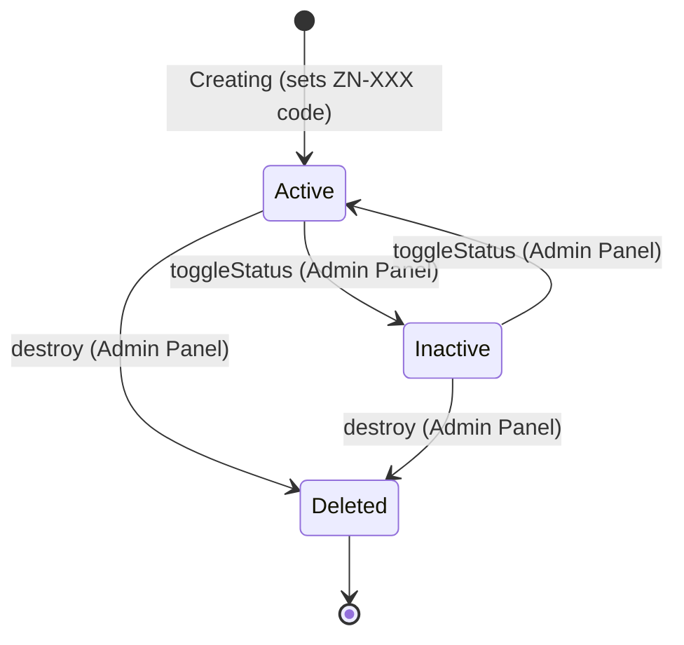
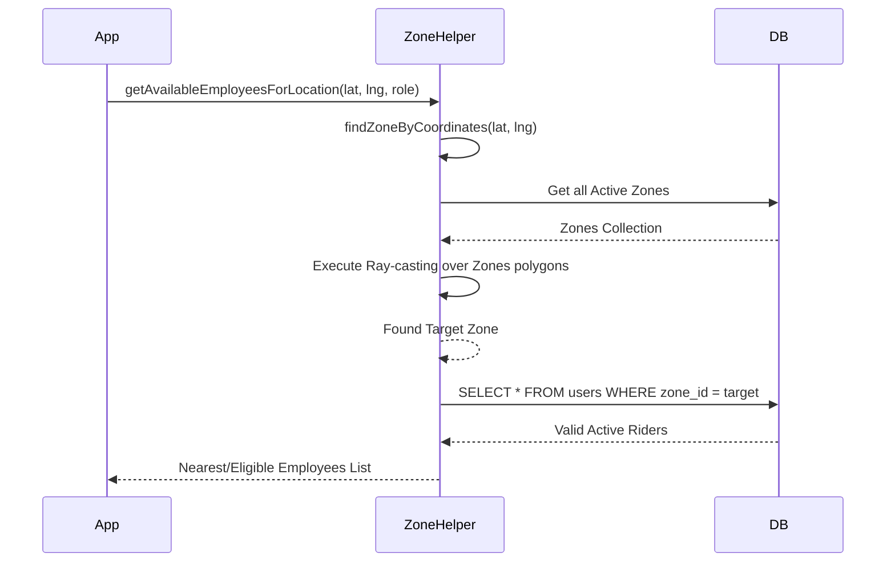

# Zone Logic & Operations Blueprint

## 1. Executive Summary

The "Zone" entity within the Boxygo Backend acts as a core geographic partition used to assign operations (Users/Riders, Shipments, and Warehouses) to specific physical boundaries. The architecture utilizes a centralized `Zone` Eloquent model backed by MySQL, with geospatial structures (`drawn_paths`) stored as JSON arrays of coordinate polygons. The system heavily leverages zones for workload distribution (scoping which shipments a User/Rider can interact with) and auto-assignment (matching a shipment's coordinate to a zone via a custom PHP ray-casting algorithm). A significant risk exists in performance: the point-in-polygon assignment logic evaluates in PHP by fetching all active zones sequentially, which forms a major bottleneck as the number of active zones and polygons increases.

## 2. Table of Contents

1. [Executive Summary](#1-executive-summary)
2. [Canonical Zone Model](#3-canonical-zone-model)
3. [Zone Lifecycle & State Machine](#4-zone-lifecycle--state-machine)
4. [Creation & Assignment Flows](#5-creation--assignment-flows)
5. [Call Graph / Dependency Map](#6-call-graph--dependency-map)
6. [APIs and Message Contracts](#7-apis-and-message-contracts)
7. [Relationship Mapping](#8-relationship-mapping)
8. [Concurrency, Transactions, and Error Handling](#9-concurrency-transactions-and-error-handling)
9. [Tests Coverage and Gaps](#10-tests-coverage-and-gaps)
10. [Security & Access Control](#11-security--access-control)
11. [Performance & Scaling Notes](#12-performance--scaling-notes)
12. [Migration & Rollout Plan](#13-migration--rollout-plan)
13. [Concrete Refactor & Improvement Recommendations](#14-concrete-refactor--improvement-recommendations)
14. [Index of References](#15-index-of-references)
15. [Open Questions & Next Steps](#16-open-questions--next-steps)

---

## 3. Canonical Zone Model

The canonical representation is the `Zone` Eloquent model mapped to the `zones` MySQL table.

**Schema (`zones` table):**
- `id` (bigint unsigned, primary key)
- `code` (string, unique): Auto-calculated sequence (e.g. `ZN-001`). 
- `name` (string): Human-readable label. 
- `city` (string, indexed): City where the zone applies. 
- `drawn_paths` (JSON, nullable): Multidimensional array of lat/lng defining boundaries. Ex: `[[{"lat": 1.2, "lng": 2.3}, ...]]`.
- `status` (enum: 'active', 'inactive', default: 'active')
- `ext_id` (integer, nullable): External ID bridging to the Assatex tracking system.
- `bound_min_lat`, `bound_max_lat`, `bound_min_lng`, `bound_max_lng` (decimals, indexed): Computed spatial bounds for high-performance coordinate filtering.
- `is_assigned_to_hub` (boolean, default: false)
- `assigned_hub_name` (string, nullable): Stores encoded JSON structure or comma-separated cluster names.
- `created_at` (timestamp)
- `updated_at` (timestamp)

**Storage Mapping:** MySQL Relational Database (no separate cache store utilized natively for zone models).

**Example API JSON representation:**
```json
{
  "id": 15,
  "code": "ZN-015",
  "name": "Downtown Cluster A",
  "city": "Dubai",
  "drawn_paths": [
    [
      {"lat": 25.1972, "lng": 55.2744},
      {"lat": 25.1990, "lng": 55.2780},
      {"lat": 25.1950, "lng": 55.2750}
    ]
  ],
  "status": "active",
  "is_assigned_to_hub": true,
  "assigned_hub_name": "Central Hub"
}
```

---

## 4. Zone Lifecycle & State Machine



**Lifecycle Events & Triggers:**
- **Creation Guard:** Eloquent `booted()` triggers `creating` event to inject `code` (using `Zone::generateNextCode()`) and forcefully set `status` to `active` if empty.
- **Deactivation/Activation Guard:** Toggled manually via SuperAdmin `PATCH /admin/zones/{zone}/status`. No downstream entity cascade (e.g., connected users stay assigned to isolated/inactive zones).
- **Deletion:** Managed via `ZoneController@destroy`.

---

## 5. Creation & Assignment Flows

### 5.1 External API Import (Automated Sync)
**Location:** `app/Jobs/SyncExternalZonesJob.php` and `app/Services/AssatexApiService.php`
The primary method of zone ingestion is syncing from an external API (Assatex). Manual zone creation via SuperAdmin has been deprecated.

```php
public function handle(AssatexApiService $apiService): void {
    // 1. Fetches zones from external HTTP endpoint
    // 2. Archives manual zones without external IDs
    // 3. Parses drawing structures and calculates bounding boxes (min_lat/lng)
    // 4. Upserts to `zones` table
}
```

### 5.2 Auto-Assignment of Employees to Zones
**Location:** `app/Services/ZoneHelper.php:207-227`  
Determines zone based on user's current GPS location.
```php
public static function autoAssignZoneToEmployee(\App\Models\User $user): ?Zone {
    // Requires lat/long explicitly stored on User.
    $zone = self::findZoneByCoordinates($user->latitude, $user->longitude);
    if ($zone) {
        $user->zone_id = $zone->id;
        $user->save();
    }
    return $zone;
}
```

### 5.3 Sequence: Identifying a Shipment's Nearest Riders


---

## 6. Call Graph / Dependency Map

**Modules and Dependency Structure:**
- `Controllers\SuperAdmin\ZoneController` ➔ `Services\ZoneService`
- `Controllers\Api\V1\ZoneController` ➔ `Services\ZoneHelper`
- `Services\ZoneService` ➔ `Repositories\ZoneRepository`
- `Services\ZoneHelper` ➔ `Models\Zone` and `Models\User`
- `Models\Shipment` ➔ Scopes (`inZone()`, `forUser()`) checking user's `zone_id` permissions.
- `Models\Warehouse` ➔ Tracks storage locations via `zone_id`.

---

## 7. APIs and Message Contracts

### 7.1 Internal SuperAdmin APIs (HTTP)
**GET `/admin/zones`**: Paginated UI listing with queries (`search`, `status`, `city`, `is_assigned_to_hub`).
**POST `/admin/zones`**: Create Zone (payload maps to fields + nested `drawn_paths` lat/lngs).
**PATCH `/admin/zones/{zone}/status`**: Toggle active/inactive (`{"status": "active|inactive"}`).
**GET `/admin/zones/api/cities`**: Extrapolates list of cities used by zones and locations.

### 7.2 Mobile App / External APIs (HTTP)
**GET `/api/v1/zones/check?lat={latitude}&lon={longitude}`**
- **Auth:** Public / Unauthenticated
- **Purpose:** Checks if requested coordinates fall within any polygon of an active zone.
- **200 Response:**
```json
{
  "exists": true,
  "data": {
    "id": 1,
    "code": "ZN-001",
    "name": "North Central",
    "city": "Dubai",
    "status": "active"
  }
}
```

### 7.3 Events & Messaging Contracts
- **Implicit Events Only:** Standard Laravel Eloquent events (`saving`, `creating`) are active, no message queue bindings (e.g. RabbitMQ/SQS) discovered specifically broadcasting `ZoneCreated` or `ZoneUpdated` messages.

---

## 8. Relationship Mapping

- **Zone -> User `hasMany` (Employees):** Users are assigned functionally via `zone_id` or an array backup `zone_ids`. (`User` model defines `hasZone()`).
- **Zone -> Shipment `hasMany` (Parcels):** Governs which riders match shipments. Filtered using `Shipment::scopeForUser(User $user)`.
- **Zone -> Warehouse `hasMany`:** Associates primary sorting warehouses to area domains. Used strictly to locate drop-offs and dispatch centers.

---

## 9. Concurrency, Transactions, and Error Handling

- **Transactions:** Standard Eloquent `save()` logic is used. Missing explicit `DB::transaction(...)` blocks in `ZoneController@store` and `ZoneController@update`. If database halts mid-request, data is dropped but no rollback constraints defined.
- **Concurrency:** No pessimistic locking (`lockForUpdate()`) or explicit optimistic locking (version IDs) exist when modifying zone borders. Two admins saving concurrently may overwrite boundaries.
- **Error Handling:** HTTP 404 handled gracefully (`abort(404)`). API coordinates checked manually returning `422` with unified error JSON wrapper in `ZoneController@check`.

---

## 10. Tests Coverage and Gaps

- **Testing Base:** There are currently **NO** unit or integration tests verifying zone functionalities (`ZoneHelper::isPointInPolygon`, `ZoneController`, `ZoneService`). 
- **Missing Test Cases:**
  1. Ray-casting correctness (test specific coords inside/outside complex concave polygons).
  2. Sequential ID race conditions during `Zone::booted()` generation of `ZN-XXX`.
  3. Security scope testing: Ensure local administrative portal employees can only view shipments from *their* assigned zones (`Shipment::scopeForUser`).

---

## 11. Security & Access Control

- **Enforcement Platform:** Spatie Permission module bindings over endpoints using roles.
- **Priverequisites:** Actions guarded via granular gate checks (`$user->can('zones.view')`, `'zones.edit'`, `'zones.delete'`, `'zones.create'`).
- **Data Isolation:** `Shipment::scopeForUser()` provides enforced multi-tenant/region isolation. If an employee belongs to `Platform: Admin Portal`, they **cannot** see shipments outside of their assigned zones.

---

## 12. Performance & Scaling Notes

**Critical Bottleneck Uncovered:** 
The method `ZoneHelper::findZoneByCoordinates()` pulls *all* active zones into PHP memory footprint:
```php
$activeZones = Zone::where('status', Zone::STATUS_ACTIVE)->get();
foreach ($activeZones as $zone) {
    if (self::isPointInPolygon($latitude, $longitude, $polygon)) { return $zone; }
}
```
**Scaling Threat:** This is linearly dependent on active zone count and vertex complexity. Performing mathematical ray-casting inside standard PHP threads will block execution, cause high CPU usage, and deplete memory limits as the network of cities/zones scale to hundreds or thousands with thousands of edges.
**Cache Profile:** Zones are queried fresh from DB constantly. No Redis/Memcached implementation caching zone structures.

---

## 13. Migration & Rollout Plan

To modernize and scale the Zone infrastructure safely:
1. **Schema Alteration:** Migrate `drawn_paths` from `JSON` to a true `POLYGON` spatial datatype using MySQL Spatial features.
2. **Data Transformation:** Write a one-off Artisan command to read JSON `drawn_paths` and encode as `ST_GeomFromGeoJSON()`.
3. **App Transformation:** Swap the PHP `isPointInPolygon` array loop to execute a MySQL Native `ST_Contains(polygon, POINT(lng, lat))` indexed query in `findZoneByCoordinates()`.
4. **Gradual Deployment:** Dual-write mechanism. Write to JSON and Spatial columns momentarily. Read from JSON. Once validated, swap reads to Spatial indexed column.

---

## 14. Concrete Refactor & Improvement Recommendations

| Priority | Effort | Recommendation | Rationale |
|----------|--------|----------------|-----------|
| **Must Do** | High | Migrate to MySQL Spatial Types. | Resolve imminent performance cliff of PHP ray-casting for geofence lookups. |
| **Should Do** | Medium | Add Redis caching layer for Zone configurations. | Zones change infrequently but are interrogated repeatedly for rider assignment constraints. |
| **Should Do** | Low | Implement Unit tests for `ZoneHelper`. | Guarantee boundary behavior (edge cases, edge line overlaps) isn't broken silently in future patches. |
| **Nice to Have** | Low | Apply optimistic concurrency locks for Admins. | Avoids Admin A overriding Admin B's map trace accidentally if saved concurrently. |

---

## 15. Index of References

- **Code:** `Zone::generateNextCode()` - `app/Models/Zone.php:57`
- **Component:** `ZoneHelper::isPointInPolygon()` - `app/Services/ZoneHelper.php:19`
- **Component:** `ZoneController@check` - `app/Http/Controllers/Api/V1/ZoneController.php:18`
- **Data Query:** `Shipment::scopeForUser()` - `app/Models/Shipment.php:530`

---

## 16. Open Questions & Next Steps

1. **Rider Capacity Calculations:** If multiple zones overlap boundaries, which priority rule determines driver allocation internally? Currently, it returns the *first* matched zone in the Eloquent Collection iteratively.
2. **Historic Location Integrity:** Does assigning a rider to a generic `zone_id` affect historic shipments if the geographic area of the zone gets modified/shrunk?
3. **Database Race Condition:** Is the method `max('id') + 1` for `CODE` generation encountering unique constraint violations in production due to lack of thread locking?

**Input Checklist Verification:**
* Repository URL / Path: local checkout `c:\Users\DELL\Downloads\Projects\boxygo-backend`
* Runtime Context: Standard Laravel 11 / PHP environment with MySQL.
